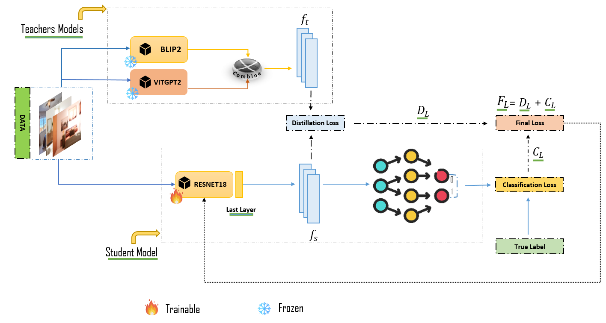
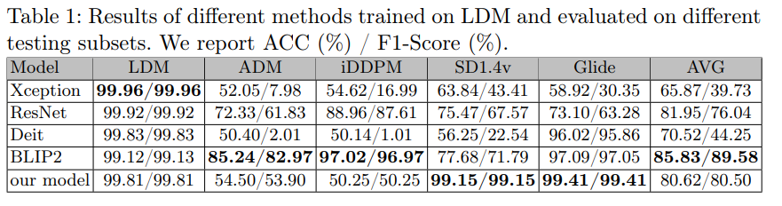

# Synthetic Image Detection using Mixture of Knowledge Distillation from Vision-Language Models
In this Work, we propose novel method that integrates the rich representational knowledge of two pretrained VLMs, BLIP2 and ViTGPT2, into the compact architecture of a pre-trained CNN, namely ResNet18. Our approach leverages the depth of knowledge present in VLMs to enable the ResNet18 model to become a skilled learner who can distinguish real images from artificially created images. We hope to push the limits of current technologies and provide the
foundation for a new generation of intelligent visual analysis systems by coordinating special cooperation between these complex models, thereby creating a
new standard in the field of synthetic image detection. 

All experiments are carried out on VS Code on Windows 10  and the detailed results are given in the paper. 
# Dataset Description : 
1- Real Part : From publicly (LSUN) Bedroom dataset . 
2- Fake Part : we used Three different diffusion models that were trained on the LSUN-Bedroom dataset produced a set of images that we collected ( ADM, IDDPM, and LDM ) and We added two more models to the collection of text-to-image generating models we collectedto  are used in our experiments: GLIDE and Stable Diffusion  
* label_Dataset: to label our datset, refer to file 'labelData.py' 

# Proposed Model : 
* Teachers Model : We Used  Pre-trained models (BLIP2, VitGPT2) are already trained on the same dataset mentioned above .
* Student Model :  We Used Pre-trained model (ResNet18) , Trained on Imagenet Dataset .  

# Expirments :
We Conducted Two Expirments 
*Exp 1 : In our first experiment, we used only the Latent Diffusion Models (LDM) dataset to train the lightweight ResNet18 model .
*EXp 2 : Training in Combined ADM and LDM Building on the insights from the first study, we extended our training by including not only ADM but also the Latent Diffusion Model (LDM) dataset.
# Usage
* Training: 
  For the training, We called the Teachers Models from `feature_extractor.py` to train our model, refer to the file `Main.py`  
* Test : 
  To evaluate the performance of our model,  refer to the file `Test.py` 
  
# Results : 
* Evaluation of LDM Trained Models :

  The evaluation of the ResNet18 model, enhanced with Vision-Language Models (VLMs) like ViTGPT2 and BLIP2, focused on its ability to detect synthetic images created by various generative models. This study deepened our understanding of the model's strengths and highlighted the benefits of integrating multiple knowledge sources for more effective image authentication.
  The experiment revealed notable variations in performance among different models. The Xception model was particularly effective at detecting text-to-image synthesis in the LDM subset but showed weaknesses in the ADM subset, indicating a challenge in generalizing to various types of synthetic images. Similarly, ResNet excelled in the LDM tests but faltered in the ADM tests, underscoring its difficulty with adversarial synthetic images' unique traits. BLIP2 generally performed well across most subsets but also struggled in the ADM subset, suggesting that even robust models could improve with more varied training approaches.

  

