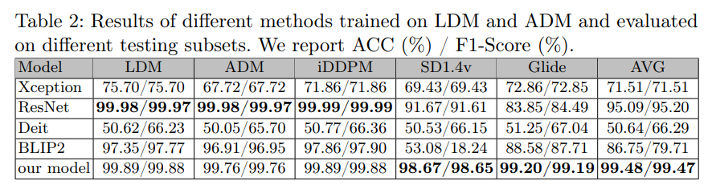

# Synthetic Image Detection using Mixture of Knowledge Distillation from Vision-Language Models
In this work, we propose a novel method that integrates the rich representational knowledge of two pre-trained VLMs, BLIP2 and ViTGPT2, into the compact architecture of a pre-trained CNN, namely ResNet18. Our approach leverages the depth of knowledge present in VLMs to enable the ResNet18 model to become a skilled learner who can distinguish real images from artificially created images. We hope to push the limits of current technologies and provide the
foundation for a new generation of intelligent visual analysis systems by coordinating special cooperation between these complex models, thereby creating a
new standard in the field of synthetic image detection. 

All experiments are carried out on VS Code on Windows 10  and the detailed results are given in the paper. 
# Dataset Description : 
1- Real Part: From publicly (LSUN) Bedroom dataset . 
2- Fake Part: we used Three different diffusion models that were trained on the LSUN-Bedroom dataset to produce a set of images that we collected ( ADM, IDDPM, and LDM ) We added two more models to the collection of text-to-image generating models we collected  are used in our experiments: GLIDE and Stable Diffusion  
* label_Dataset: to label our dataset, refer to file 'labelData.py' 

# Proposed Model : 
* Teachers Model: We Used  Pre-trained models (BLIP2, VitGPT2) that are already trained on the same dataset mentioned above.
* Student Model:  We Used a Pre-trained model (ResNet18), Trained on Imagenet Dataset.  

# Expirments :
We Conducted Two Expirments 
*Exp 1: In our first experiment, we used only the Latent Diffusion Models (LDM) dataset to train the lightweight ResNet18 model .
*EXp 2: Training in Combined ADM and LDM Building on the insights from the first study, we extended our training by including not only ADM but also the Latent Diffusion Model (LDM) dataset.
# Usage
* Training: 
  For the training, We called the Teachers Models from `feature_extractor.py` to train our model, refer to the file `Main.py`  
* Test : 
  To evaluate the performance of our model,  refer to the file `Test.py` 
  
# Results : 
* Evaluation of LDM Trained Models :

  The evaluation of the ResNet18 model, enhanced with Vision-Language Models (VLMs) like ViTGPT2 and BLIP2, focused on its ability to detect synthetic images created by various generative models. This study deepened our understanding of the model's strengths and highlighted the benefits of integrating multiple knowledge sources for more effective image authentication.
  The experiment revealed notable variations in performance among different models. The Xception model was particularly effective at detecting text-to-image synthesis in the LDM subset but showed weaknesses in the ADM subset, indicating a challenge in generalizing to various types of synthetic images. Similarly, ResNet excelled in the LDM tests but faltered in the ADM tests, underscoring its difficulty with adversarial synthetic images' unique traits. BLIP2 generally performed well across most subsets but also struggled in the ADM subset, suggesting that even robust models could improve with more varied training approaches.

  

  * Evaluation of Combined ADM and LDM Trained Models :
 

    The study evaluated the performance of models trained on a combined dataset of Latent Diffusion Models (LDM) and Antagonistic Diffusion Models (ADM), revealing significant behavioral patterns under various testing conditions. The Xception model, with an average accuracy and F1-score of 71.51%, performed better when trained on this enhanced dataset than on ADM data alone, underscoring the advantages of a larger feature set while also indicating areas needing further enhancement for more consistent accuracy across different generative models. ResNet demonstrated strong adaptability, achieving near-perfect scores on the LDM and ADM subsets but lower performance on the SD1.4v and Glide subsets, suggesting its effective use of diverse data to improve generalization. Similarly, BLIP2 performed well in the LDM and ADM categories but struggled with the SD1.4v subset, emphasizing the need for models to adapt to the specific characteristics of each generative technique.

Figure 3 demonstrates our model's strong ability to distinguish between synthetic and real images across various test sets. It achieved high true positive rates, accurately identifying almost all synthetic images in the LDM, ADM, and IDDPM subsets, with counts of 9,955, 9,843, and 9,980 respectively, and performed well in recognizing 9,992 and 9,736 out of 10,000 images in the Stable Diffusion and Glide subsets. Despite its precision, there's room for improvement in reducing false negatives, which vary across subgroups. Our results underscore the critical role of model architecture and the complexities of synthetic image generation techniques. The incorporation of advanced models like BLIP2 and VitGPT2, which integrate visual and language data, enhances detection precision across diverse scenarios, promoting the development of intelligent systems that can adapt to new generative techniques. This underscores the need for versatile training strategies to enhance the precision and reliability of synthetic image detection in a complex digital environment.

